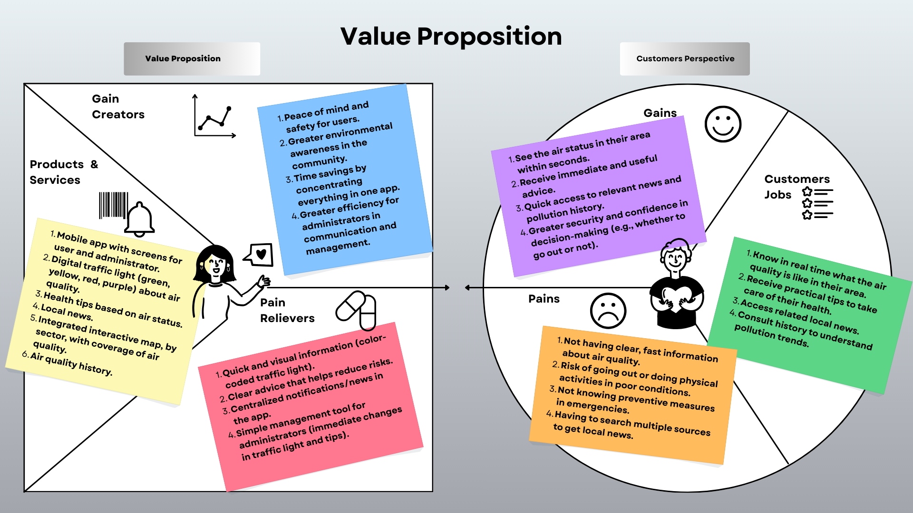

# AirLight – UXD Project  

---

# Index

1. [Introduction](#1-introduction)  
   1.1 [The Problem](#11-the-problem)  
   1.2 [Our Solution](#12-our-solution)  

2. [Team & Roles](#2-team--roles)  

3. [Strategy](#3-strategy)  
   3.1 [Value Proposition Canvas](#31-value-proposition-canvas)  
   3.2 [UX Personas](#32-ux-personas)  
   3.3 [Benchmarking](#33-benchmarking)

4. [Scope](#4-scope)  
   4.1 [Costumer Journey Map](#41-costumer-journey-map)

5. [Structure](#4-structure)  
   5.1 [Navigation Flow](#51-navigation-flow)
   5.1.1 [Web Admin View](#511-web-admin-view)
   5.1.2 [Mobile User View](#512-mobile-user-view) 

---

## 1. Introduction  

### 1.1 The Problem  
Air pollution in southern Chile (Temuco, Padre Las Casas, Labranza) is a serious health concern.  
Citizens often:  
- Lack fast and reliable information about air quality.  
- Don’t know what preventive measures to take in emergencies.  
- Must search across multiple websites to access local news and updates.  

At the same time, administrators face difficulties in:  
- Communicating alerts to the population in real time.  
- Managing several data sources.  
- Centralizing information into a single registry/digital library.  

### 1.2 Our Solution  
We propose a **mobile application – AirLight** with two profiles:  

- **Citizen User**  
  - Immediately sees the **traffic-light indicator** (green, yellow, red and purple).  
  - Receives clear **health recommendations** according to air status.  
  - Accesses **interactive maps**, **local news**, and an **air quality history**.  

- **Administrator**  
  - Updates the **air status** in real time.  
  - Publishes **recommendations** and **local news**.  
  - Manages **map signals** and **historical data**.  

This solution promotes **awareness, prevention, and efficiency** in communication between authorities and citizens.  

---

## 2. Team & Roles  

- **Cristopher Gallegos** → Analyst.  
- **Eduardo Krause** → UI Designer.  
- **Enrique Pincheira** → Presenter.
- **Angel Rocha** → UX Designer.
- **Daniel Sepúlveda** → Project Manager.  

---

## 3. Strategy  

### 3.1 Value Proposition Canvas  
The Value Proposition Canvas aligns the app’s services with the needs of both **citizens** and **administrators**.  

- **Products & Services**:  
  Mobile app, air quality traffic-light, health advice, local news, interactive map, history.  

- **Pain Relievers**:  
  Quick and visual information, practical recommendations, centralized alerts, easy admin tools.  

- **Gain Creators**:  
  Safety and trust for users, awareness in the community, efficient communication, time-saving.  

---

### 3.2 UX Personas  

#### UXP 1 – Physical Education Teacher

---

#### UXP 2 – Young Adult Athlete
  

---

#### UXP 3 – Senior Citizen
  
  
---

### 3.3 Benchmarking

To design an application that truly responds to the needs of citizens and administrators in southern Chile, it was essential to analyze existing air quality platforms — including both direct competitors and indirect references recognized for their design and usability.  

To understand how our air quality application can stand out and truly address user needs, we conducted a comparative analysis of existing solutions in the market.

The goal was to identify strengths, weaknesses, and opportunity gaps, both functionally and visually, in order to integrate best practices and avoid common pitfalls.

We considered different types of references:
Direct competitors: Air quality applications such as Aire Santiago, AirVisual, and Aire Temuco.
Data platforms: Services recognized for their clear way of displaying environmental and health information.
User experience references: Applications known for their modern, accessible, and minimalistic design, which inspired the aesthetic and usability of our solution.

*Figure: Benchmarking of AirLight vs. existing air quality apps (Aire Santiago, AirVisual, Aire Temuco) using the Four Actions Framework.*  

---

## 4. Scope

### 4.1 Costumer Journey Map

---

## 5. Structure

### 5.1 Navigation Flow

#### 5.1.1 Web Admin View

#### 5.1.2 Mobile User View

---

This documentation is part of the **Human–Computer Interface Design** course project and follows UXD methodology for academic purposes.  
