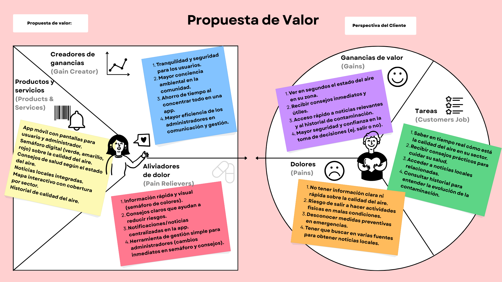

# AirLight – UXD Project  

---

# Index

1. [Introduction](#1-introduction)  
   1.1 [The Problem](#11-the-problem)  
   1.2 [Our Solution](#12-our-solution)  

2. [Team & Roles](#2-team--roles)  

3. [Strategy](#3-strategy)  
   3.1 [Value Proposition Canvas](#31-value-proposition-canvas)  
   3.2 [UX Personas](#32-ux-personas)  
   3.3 [Benchmarking](#33-benchmarking)  

---

## 1. Introduction  

### 1.1 The Problem  
Air pollution in southern Chile (Temuco, Padre Las Casas, Labranza) is a serious health concern.  
Citizens often:  
- Lack fast and reliable information about air quality.  
- Don’t know what preventive measures to take in emergencies.  
- Must search across multiple websites to access local news and updates.  

At the same time, administrators face difficulties in:  
- Communicating alerts to the population in real time.  
- Managing several data sources.  
- Centralizing information in a single platform.  

### 1.2 Our Solution  
We propose a **mobile application – AirLight** with two profiles:  

- **Citizen User**  
  - Immediately sees the **traffic-light indicator** (green, yellow, red).  
  - Receives clear **health recommendations** according to air status.  
  - Accesses **interactive maps**, **local news**, and an **air quality history**.  

- **Administrator**  
  - Updates the **air status** in real time.  
  - Publishes **recommendations** and **local news**.  
  - Manages **map signals** and **historical data**.  

This solution promotes **awareness, prevention, and efficiency** in communication between authorities and citizens.  

---

## 2. Team & Roles  

- **Research & Personas** → Characterization of users, mental models, usability studies.  
- **Navigation & Prototypes** → User flows, diagrams, Figma prototypes.  
- **Documentation & Deliverables** → Reports, Value Proposition Canvas, final PDFs.  

---

## 3. Strategy  

### 3.1 Value Proposition Canvas  
The Value Proposition Canvas aligns the app’s services with the needs of both **citizens** and **administrators**.  

- **Products & Services**:  
  Mobile app, air quality traffic-light, health advice, local news, interactive map, history.  

- **Pain Relievers**:  
  Quick and visual information, practical recommendations, centralized alerts, easy admin tools.  

- **Gain Creators**:  
  Safety and trust for users, awareness in the community, efficient communication, time-saving.  

---

### 3.2 UX Personas  

#### UXP 1 – Physical Education Teacher  
- **Name:** Carlos Muñoz  
- **Age:** 38  
- **Occupation:** Physical Education Teacher  
- **Background:** Works at a high school in Temuco. Responsible for outdoor physical activities with students. Needs to evaluate if conditions are safe before class.  
- **Goals:** Ensure students’ health, plan outdoor lessons only if conditions are safe, make quick decisions.  
- **Pains:** Lack of reliable info, concern about respiratory problems in students, sudden changes in air quality.  
- **Behaviors:** Checks the AirLight app before school and before each outdoor class. Uses the traffic-light system to decide activities.  

---

#### UXP 2 – Young Adult Athlete  
- **Name:** Daniela Rivas  
- **Age:** 24  
- **Occupation:** University Student, Amateur Runner  
- **Background:** Lives in Padre Las Casas. Enjoys running and cycling outdoors daily. Needs safe conditions to maintain health and performance.  
- **Goals:** Exercise safely, choose best times and areas for training, monitor neighborhood conditions.  
- **Pains:** Frustration when training is canceled due to pollution, lack of forecast, multiple unreliable sources.  
- **Behaviors:** Opens AirLight daily before training, checks the map for best zones, shares alerts with peers.  

---

#### UXP 3 – Senior Citizen  
- **Name:** Jorge Ramírez  
- **Age:** 70  
- **Occupation:** Retired Engineer  
- **Background:** Lives in Labranza. Likes walking every morning to stay active. Vulnerable due to age and respiratory conditions.  
- **Goals:** Walk outdoors safely, know immediately if air is suitable, receive simple advice.  
- **Pains:** Anxiety about health risks, difficulty interpreting technical data, cannot easily relocate to cleaner areas.  
- **Behaviors:** Uses AirLight every morning before going out, relies on colors and advice, checks local news regularly.  

---

### 3.3 Benchmarking 

This documentation is part of the **Human–Computer Interface Design** course project and follows UXD methodology for academic purposes.  
