# AirLight – UXD Project  

---

# Index

1. [Introduction](#1-introduction)  
   1.1 [The Problem](#11-the-problem)  
   1.2 [Our Solution](#12-our-solution)  

2. [Team & Roles](#2-team--roles)  

3. [Strategy](#3-strategy)  
   3.1 [Value Proposition Canvas](#31-value-proposition-canvas)  
   3.2 [UX Personas](#32-ux-personas)  
   3.3 [Benchmarking](#33-benchmarking)

4. [Scope](#4-scope)  
   4.1 [Costumer Journey Map](#41-costumer-journey-map)

5. [Structure](#5-structure)  
   5.1 [Navigation Flow](#51-navigation-flow)   
   5.1.1 [Web Admin View](#511-web-admin-view)   
   5.1.2 [Mobile User View](#512-mobile-user-view)

6. [Skeleton](#6-skeleton)   
   6.1 [Low-Fi Wireframes](#61-low-fi-wireframes)
    
7. [Interactive Prototypes](#7-interactive-prototypes) 

8. [Surface](#8-surface)  
   8.1 [Mockups v1](#81-mockups-v1)  
   8.2 [Mockups v2](#82-mockups-v2)  

---

## 1. Introduction  

### 1.1 The Problem  
Air pollution in southern Chile (Temuco, Padre Las Casas, Labranza) is a serious health concern.  
Citizens often:  
- Lack fast and reliable information about air quality.  
- Don’t know what preventive measures to take in emergencies.  
- Must search across multiple websites to access local news and updates.  

At the same time, administrators face difficulties in:  
- Communicating alerts to the population in real time.  
- Managing several data sources.  
- Centralizing information into a single registry/digital library.  

### 1.2 Our Solution  
We propose a web and mobile application – AirLight – with two profiles: administrator and citizen user. 

- **Citizen User**  
  - Immediately sees the **traffic-light indicator** (green, yellow, red and purple).  
  - Receives clear **health recommendations** according to air status.  
  - Accesses **interactive maps**, **local news**, and an **air quality history**.  

- **Administrator**  
  - Updates the **air status** in real time.  
  - Publishes **recommendations** and **local news**.  
  - Manages **map signals** and **historical data**.  

This solution promotes **awareness, prevention, and efficiency** in communication between authorities and citizens.  

---

## 2. Team & Roles  

- **Cristopher Gallegos** → Analyst.  
- **Eduardo Krause** → UI Designer.  
- **Enrique Pincheira** → Presenter.
- **Angel Rocha** → UX Designer.
- **Daniel Sepúlveda** → Project Manager.  

---

## 3. Strategy  

### 3.1 Value Proposition Canvas  
The Value Proposition Canvas aligns the app’s services with the needs of both **citizens** and **administrators**.  

- **Products & Services**:  
  Mobile app, air quality traffic-light, health advice, local news, interactive map, history.  

- **Pain Relievers**:  
  Quick and visual information, practical recommendations, centralized alerts, easy admin tools.  

- **Gain Creators**:  
  Safety and trust for users, awareness in the community, efficient communication, time-saving.  

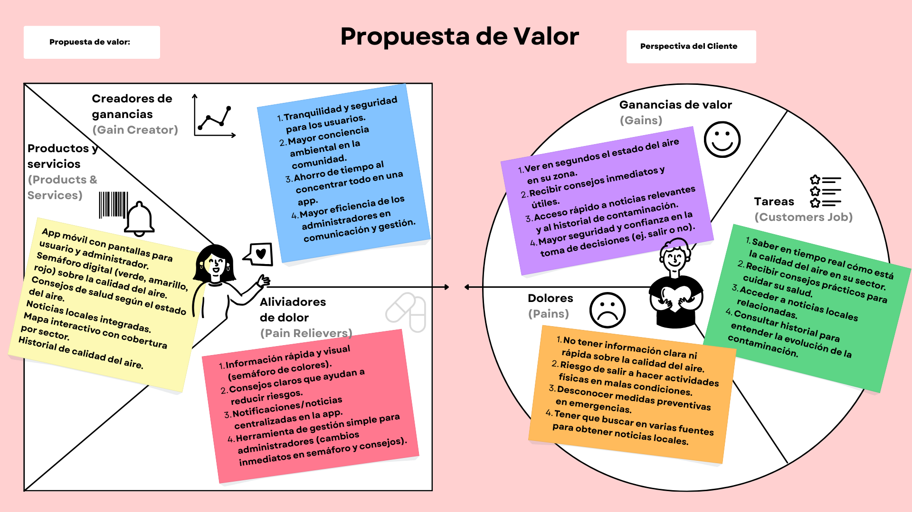

---

### 3.2 UX Personas  

#### UXP 1 – Physical Education Teacher
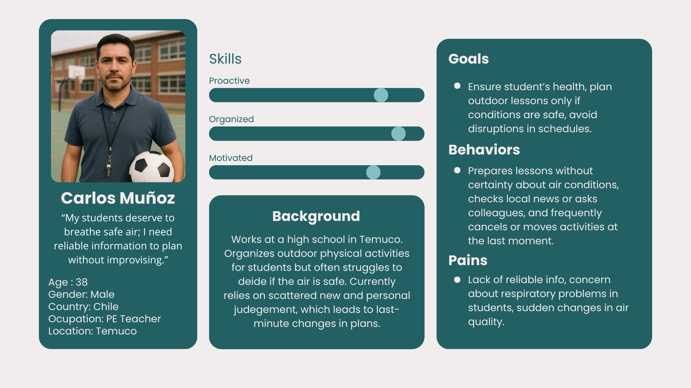

---

#### UXP 2 – Young Adult Athlete
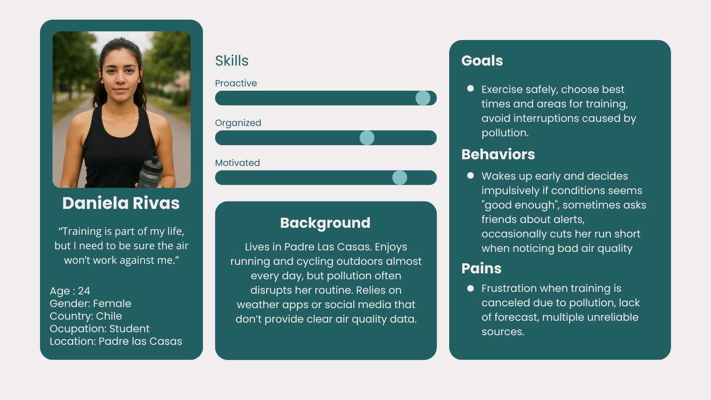  

---

#### UXP 3 – Senior Citizen
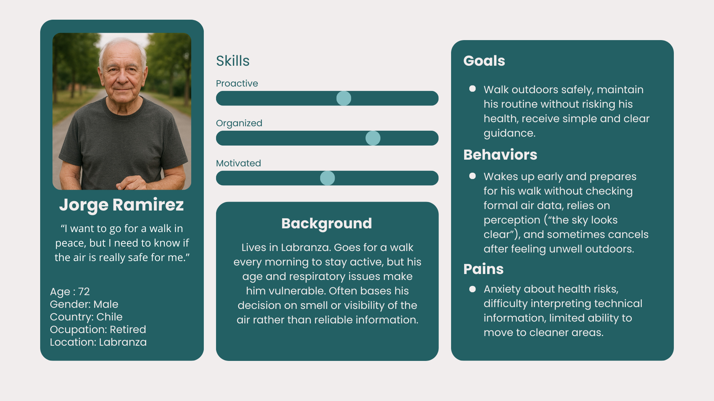  
  
---

### 3.3 Benchmarking

To design an application that truly responds to the needs of citizens and administrators in southern Chile, it was essential to analyze existing air quality platforms — including both direct competitors and indirect references recognized for their design and usability.  

To understand how our air quality application can stand out and truly address user needs, we conducted a comparative analysis of existing solutions in the market.

The goal was to identify strengths, weaknesses, and opportunity gaps, both functionally and visually, in order to integrate best practices and avoid common pitfalls.

We considered different types of references:
Direct competitors: Air quality applications such as Aire Santiago, AirVisual, and Aire Temuco.
Data platforms: Services recognized for their clear way of displaying environmental and health information.
User experience references: Applications known for their modern, accessible, and minimalistic design, which inspired the aesthetic and usability of our solution.

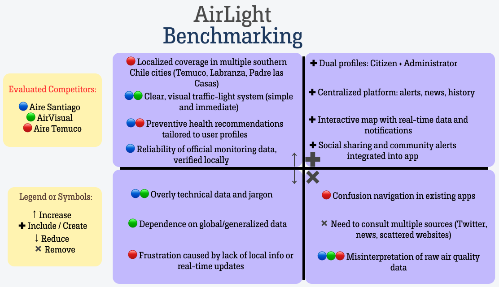

*Figure: Benchmarking of AirLight vs. existing air quality apps (Aire Santiago, AirVisual, Aire Temuco) using the Four Actions Framework.*  

---

## 4. Scope

### 4.1 Costumer Journey Map

These stages reflect the complete journey — from first contact to long-term perception and potential recommendation.

---

## 5. Structure

### 5.1 Navigation Flow

#### 5.1.1 Web Admin View

#### 5.1.2 Mobile User View

---

## 6. Skeleton

### 6.1 Low-Fi Wireframes

Prototype 1: Admin Web

Purpose: Allows the administrator to manage air quality traffic lights, news, and health advice, as well as view records and interactive maps.

Main Views and Features:

1.- Admin Login
   - Requests username and password.
   - Provides secure access to the system.

2.- Home (Dashboard)
   - Traffic Light: Shows the current status using colors (green, yellow, red).      
      - Admin can change the status by clicking on a color.
   - News: Editable section; opens another view to select or edit news items.
   - Health Advice: Editable directly in the designated area.

3.- Traffic Light Records
   - Displays a table with the following data:      
      - Traffic light ID
      - Location
      - Date
      - PM (Particulate Matter)
      - AQI (Air Quality Index)
      - Status
   - Options:      
      - Filter: Sort or search within the table.      
      - Add Record: Opens a form to manually enter new data.

4.- Traffic Light Map
   - Shows a map with icons for active traffic lights in different areas.
   - Clicking an icon displays a traffic light details panel.
    -Clicking elsewhere on the map opens a larger map with a report details panel submitted by users (mobile version).

5.- Global Header (on all views)
   - Navigation buttons: Home, Map, Records/History.
   - Logo on the left.
   - Logout icon on the right.

---

Prototype 2: Mobile User

Purpose: Allows users to view air quality traffic lights, get health advice, read news, access maps, and report issues.

Main Views and Features:

1.- Login View
   - Users can log in with email and password.
   - If they don’t have an account, they are redirected to the Registration View.

2.- Registration View
   - Requests: Name, email, phone number, and password.
   - After registration or pressing Back, users return to the Login View.

3.- Home (Dashboard)
   - Displays a traffic light with its current color and status.
   - Next to it: AQI value and main pollutant.
   - Below: Health advice.
   - At the bottom: Brief news with a “[Read More]” link that opens the full news.      
      - Full news view includes a Back button to return to Home.

4.- Map Button / Mini Map View
   - Shows a map occupying about half the screen.
   - Below the map: details for the user’s location.
   - Clicking the map opens the Full Map View.

5.- Full Map View
   - Larger map similar to the Admin map.
   - Users cannot see other reports.
    -Users can report a faulty traffic light: clicking Report opens a mini view to detail the issue and submit it.

6.- History View
   - Displays the same table as Admin, but read-only.
   - Users can use the Filter button to sort the data.

7.- Navigation and Header
   - Logout button at the top-right in all main views.
   - Navigation bar at the bottom to switch between Home, Map, and History.

---

## 7. Interactive Prototypes

Design Notes:
   - This prototype is considered a low-fidelity wireframe: it demonstrates layout and feature placement, not final visual design.
   - Useful for validating structure, navigation, and interaction logic before moving to high-fidelity prototypes.

📁 [Wireframes Workspace - AirLight](https://www.figma.com/design/tXHDp6oZXnSSmCe95MtALs/Diseño-Interface-Humano-Computador?node-id=2508-29&p=f&t=Uxyh6QSb6Syg6mdW-0)      
Complete set of initial low-fidelity wireframes available in the shared Figma workspace, including all early-stage interface concepts.

---

Design Notes:
Within this space, both low-fidelity wireframes (Low-Fi) and high-fidelity prototypes (HD) were developed to visualize the system’s structure, navigation, and interaction before implementation.

Through Figma, the team was able to:
   - Design and link screens to simulate the user experience (for both mobile and web).
   - Collaborate in real time, making adjustments and comments directly on the designs.
   - Validate usability and visual consistency before moving to the development phase.
   
📁 [Figma Workspace - AirLight](https://www.figma.com/design/tXHDp6oZXnSSmCe95MtALs/Diseño-Interface-Humano-Computador?node-id=3235-1348&p=f&t=YFDD8SZagKvsHPH0-0).
In summary, the Figma Workspace serves as the central hub for visual design and usability validation of the AirLight project.

---

## 8. Surface
This layer defines the final visual appearance of AirLight. We applied the visual identity, color palette, and typography to bring the wireframes to life, ensuring the interface is both aesthetically pleasing and functional.

### 8.1 Mockups v1
In this first high-fidelity iteration, we translated the skeletal structure into visual designs. The focus was on applying the Air Quality Color System (Green, Yellow, Orange, Red, Purple) to test how users perceive the alerts.

Key focus areas:
Application of the primary color palette to the "Traffic Light" indicator.  
Basic layout of the Dashboard and Login screens for both Web and Mobile.  
Initial testing of typography readability on the History tables.  

(Note: Insert a collage image here showing the early versions of the Dashboard and Login).

Login Views:  
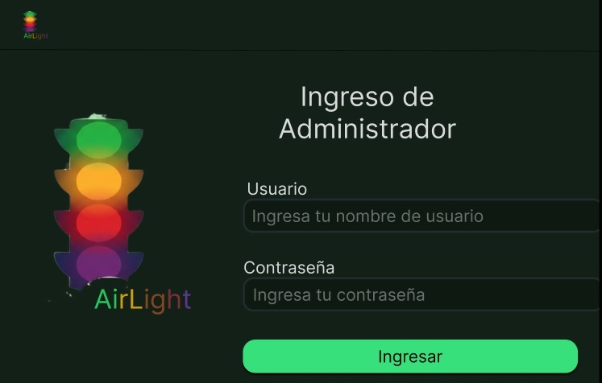   
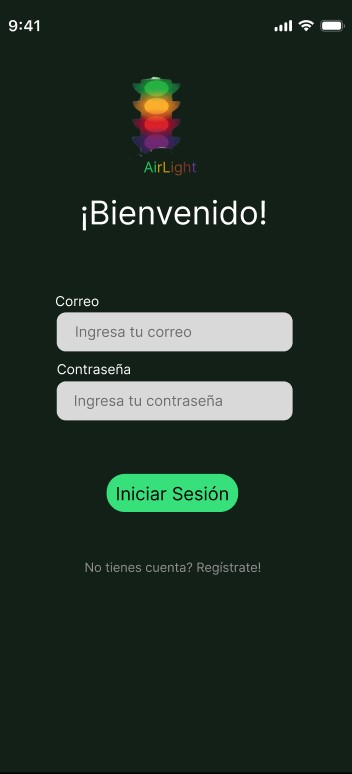  

Dashboards Views:  
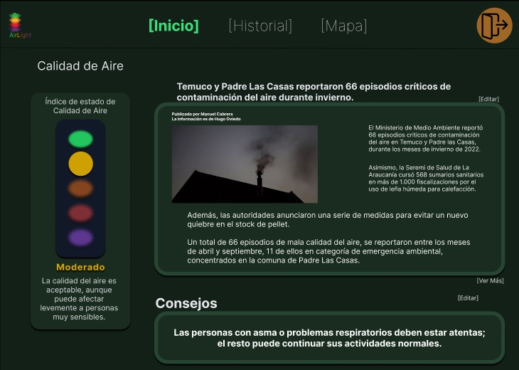   
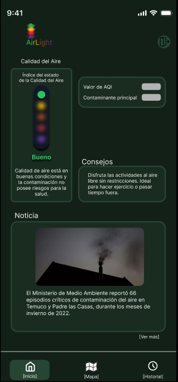   

History Views:  
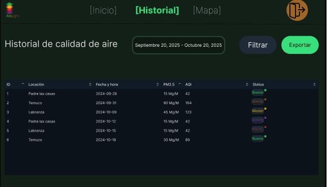   
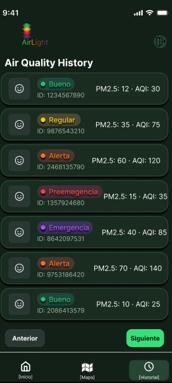  

Map Views:  
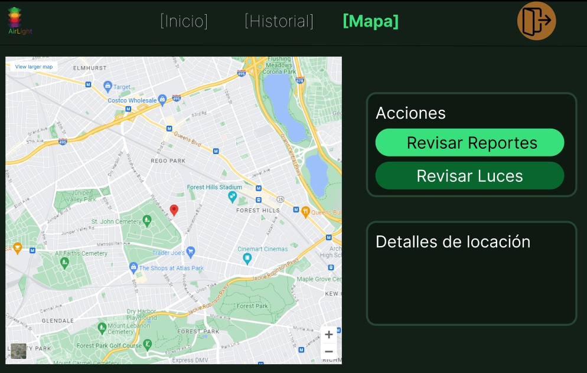   
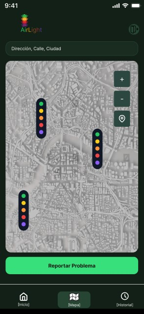  

---

### 8.2 Mockups v2
Based on visual analysis and consistency checks, we developed the final version of the interface. This version improves visual hierarchy, accessibility contrasts, and introduces the complete feature set for system administration.  
We prioritized the four core views to ensure a seamless user experience across devices:

A. Web Admin Interface
The desktop view has been expanded into a comprehensive command center, divided into three key operational areas:

Login: Clean and secure entry point for administrators.
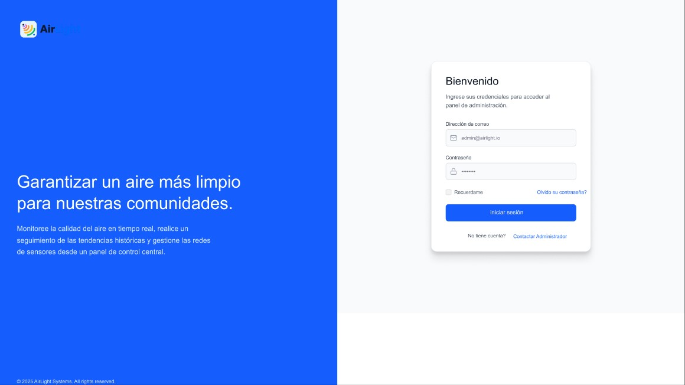 

Dashboard: The central hub displaying the current global status. Add News: A content management tool to publish health advice and local updates directly to the mobile app.
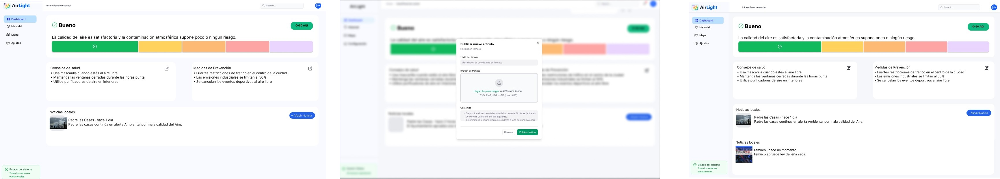 

History & Add Record: Full access to historical data logs with the ability to manually input new air quality records.  
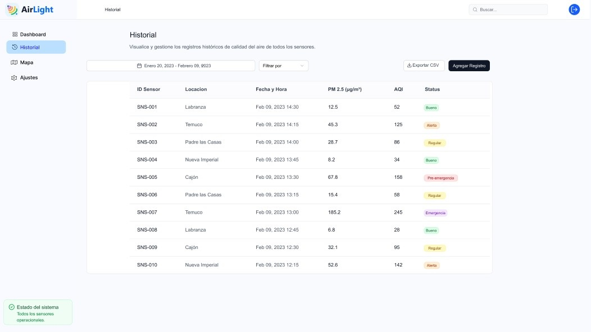  
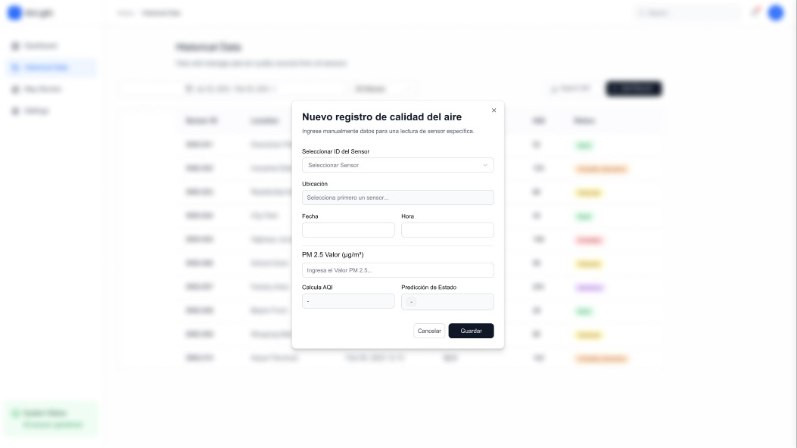 

Map & Reports: Allows the admin to view the location of active sensors and review specific reports submitted by citizens. 
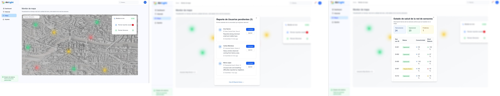 

Settings: A robust section for platform management.  
   - Profile Management: Edit admin details.
   - User Roles: Create and manage Administrator or Standard User profiles.
   - Appearance: Includes a Dark Mode toggle, allowing the interface to adapt to low-light environments for better visual ergonomics.
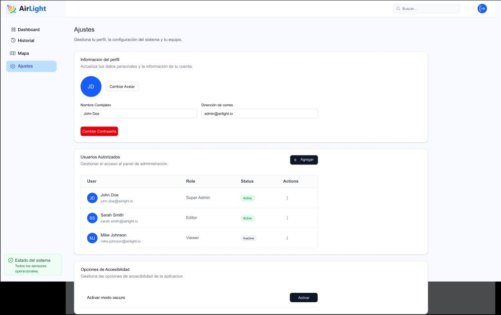
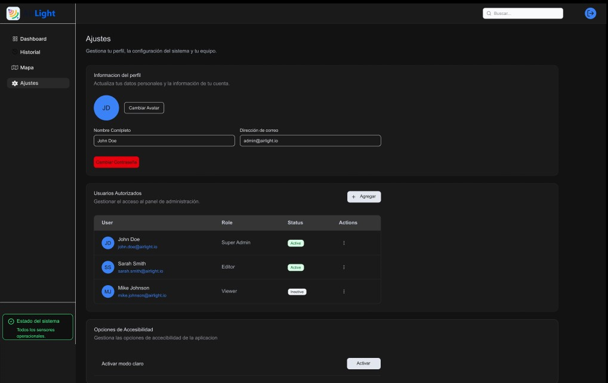 

B. Mobile User Interface
The mobile view is optimized for quick interactions and on-the-go readability.

Login: Simplified access for citizens with registration and password recovery

Dashboard: Prioritizes the current status color and immediate health recommendations.

Map: Interactive touch interface to check air quality in specific neighborhoods.
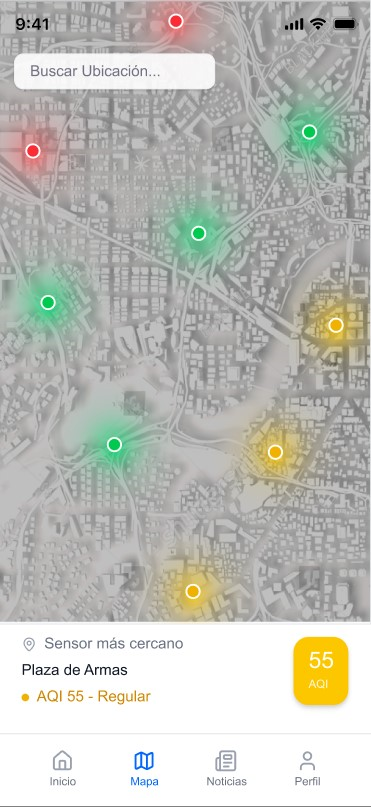

User Profile & Personalization: A comprehensive settings section that allows users to:
   - Manage Personal Information: Update contact details and profile photos.
   - Security: Change passwords and manage account privacy.
   - Health Profile: Crucially, users can toggle specific conditions (e.g., Asthma, Seasonal Allergies, Cardiovascular conditions). This input allows the app to provide tailored notifications for "Sensitive Groups."  
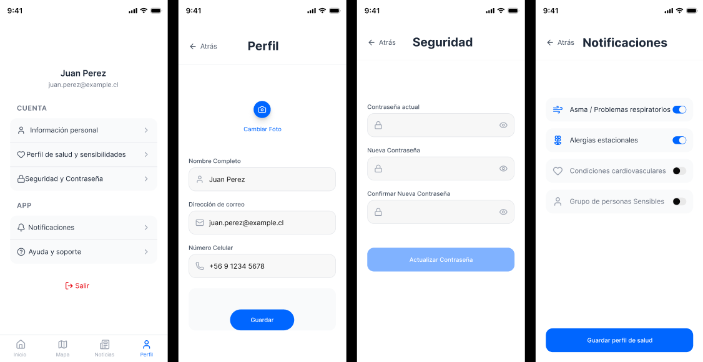

***Design Evolution (v1 vs. v2): Removal of User History In the transition to v2, the History View was removed from the Mobile User interface.***
***Rationale: User testing and analysis determined that while historical data is essential for Administrators (for pattern analysis and reporting), Citizen Users prioritize real-time data and immediate action. Removing the historical table reduced cognitive load and streamlined the mobile navigation bar to the three most essential features: Status (Home), Location (Map), and Personalization (Profile).***

---

This documentation is part of the **Human–Computer Interface Design** course project and follows UXD methodology for academic purposes.  
